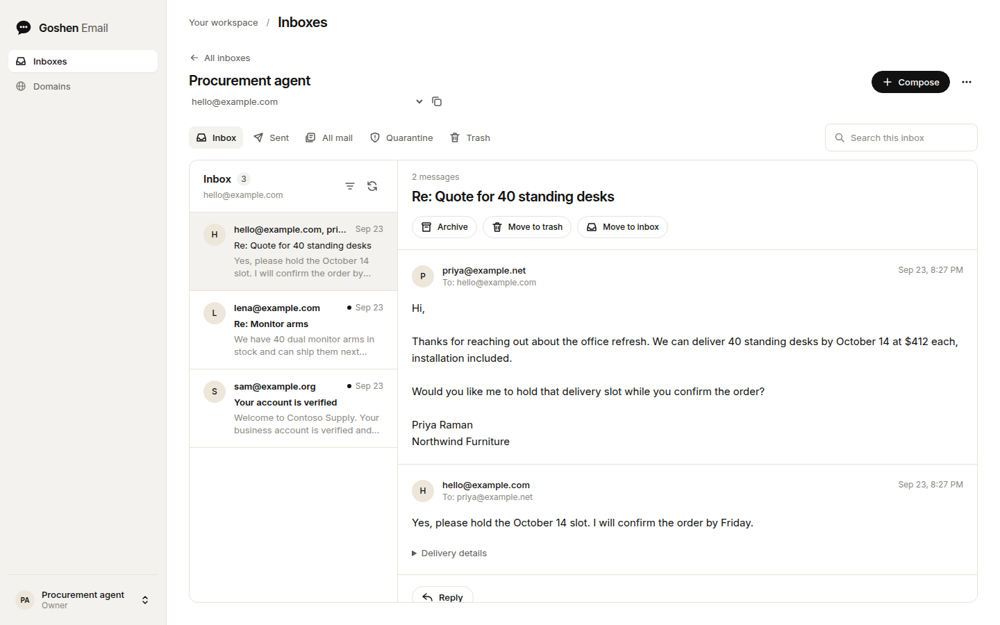
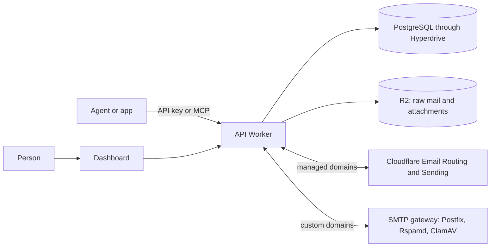

# Goshen Email

Email inboxes for AI agents. Each agent gets a real address, threads,
attachments, and an API key that reaches only its own mail. People see the same
mail in a dashboard, where they can reply, check delivery, and release
quarantined messages.

[Hosted service](https://goshenemail.com) ·
[Documentation](https://goshenemail.com/docs) ·
[API reference](https://goshenemail.com/docs/api) ·
[Contributing](CONTRIBUTING.md) ·
[License](LICENSE)



## What it does

- One API call creates an inbox. Inboxes send, receive, and reply, and replies
  stay threaded with the original conversation.
- The REST API has 17 operations, described in an
  [OpenAPI document](docs/openapi.json). TypeScript and Python SDKs, a JSON CLI,
  and an MCP server (hosted or stdio) expose the same 17 operations.
- An account key reaches every inbox in its account, limited to the scopes you
  pick. A mailbox key reaches one inbox. No key can release quarantine or
  create other keys.
- Every send needs an idempotency key. Retrying a timed-out send with the same
  key and contents never sends a second copy.
- Mail on custom domains arrives through an SMTP gateway that checks SPF, DKIM,
  and DMARC and scans with Rspamd and ClamAV. Spam, failed authentication, and
  malware wait in quarantine until a person releases them.
- Signed webhooks report new mail and delivery outcomes: delivered, deferred,
  bounced, failed, rejected, and complained.
- Optional triage labels new mail with a category, whether it needs a reply,
  and an urgency score.

## How it fits together



| Path | Contents |
| --- | --- |
| [`apps/email`](apps/email) | The API, a Cloudflare Worker. It stores mailboxes, sends and receives mail, and serves the REST API, the older RPC API, and hosted MCP. |
| [`apps/email-dashboard`](apps/email-dashboard) | The dashboard, homepage, and docs site. It runs as a Cloudflare Worker, or as a Node server for local or VPS hosting. |
| [`apps/email-web`](apps/email-web) | A redesigned dashboard on Pluto's design system. It calls the dashboard's `/api` routes, holds no credentials, and is not deployed yet. |
| [`apps/email-gateway`](apps/email-gateway) | The SMTP gateway for domains at any DNS provider, packaged with Docker. |
| [`packages/email-sdk`](packages/email-sdk) | TypeScript and JavaScript client. |
| [`packages/email-python`](packages/email-python) | Python client. It uses only the standard library. |
| [`packages/email-cli`](packages/email-cli) | Command-line client that prints JSON. |
| [`packages/email-mcp`](packages/email-mcp) | MCP server over stdio. |
| [`ops/email`](ops/email) | The gateway's Docker Compose, Caddy, and Rspamd configuration, plus reviewed SQL for the hosted database. |
| [`ops/autumn`](ops/autumn) | Plan definitions for hosted billing. |
| [`docs`](docs) | Operator guides and the OpenAPI document. |

## Try it locally

You need Node.js 24 and pnpm 10.15.1. The local fixture runs the API and the
dashboard against an in-memory PostgreSQL database (PGlite). Routing, domain
checks, sending, and file storage are test doubles, so you need no accounts or
credentials, and no mail leaves your machine.

```sh
git clone https://github.com/boringcomputers/goshen-email.git
cd goshen-email
pnpm install --frozen-lockfile
pnpm build
pnpm --filter @bezalel/email exec tsx test/dashboard-fixture.ts
```

Open <http://127.0.0.1:3038/app> and sign in with the fixture password,
`fixture-dashboard-password-fixture-dashboard-password-`. Create an inbox with
the username `hello`, then deliver a message to it from a second terminal:

```sh
curl -X POST http://127.0.0.1:3039/receive \
  -H 'Content-Type: application/json' \
  -d '{"inboxId":"hello@example.com","subject":"Hello from the fixture"}'
```

The message appears in the inbox. Mail you send or reply with from the
dashboard stays inside the fixture; `curl http://127.0.0.1:3039/sends` lists it.
The fixture listens on loopback only. Don't deploy it.

## Self-host

Goshen Email runs on Cloudflare. A deployment needs:

- A Cloudflare account on the Workers Paid plan, with Email Sending and Email
  Routing set up for your domain.
- A PostgreSQL database that Cloudflare Hyperdrive can reach. The guide uses
  PlanetScale.
- An R2 bucket, plus a delivery queue and its dead-letter queue.
- For customer domains at other DNS providers, a server that allows SMTP on
  port 25.

`apps/email/wrangler.jsonc` and `apps/email-dashboard/wrangler.jsonc` contain
the hosted service's account ID, resource IDs, routes, and domains. Replace
them with your own before you deploy. The [Worker guide](apps/email/README.md)
lists the API Worker's settings. In the dashboard's file:

- Point the `MAIL_API` service binding at your API Worker's name, and set
  `MAIL_WORKER_URL` to that Worker's HTTPS origin.
- Set `DASHBOARD_PUBLIC_URL` and `routes` to your dashboard's domain.
- Remove the `NATIVE_MAIL_API` service binding and the `NATIVE_MAIL_*`
  variables. They connect the hosted dashboard to a separate Bezalel
  deployment.

1. Set up the API Worker with the [Worker guide](apps/email/README.md). It
   covers the Cloudflare account, secrets, R2, and queues.
2. Create the database and connect Hyperdrive with the
   [database guide](docs/planetscale.md). Put a direct connection string in
   `apps/email/.env` as `DATABASE_URL` and run `pnpm migrate`. It applies the
   full schema and is safe to rerun on upgrades.
3. Pick a dashboard. The Cloudflare Worker dashboard supports public
   passwordless accounts; follow the [account guide](docs/accounts.md). The
   Node dashboard below uses one shared owner password and can see every inbox,
   so use it only for a single operator.
4. For customer domains, deploy the SMTP gateway with its
   [runbook](ops/email/README.md).
5. Deploy with `pnpm deploy:worker`, then `pnpm deploy:dashboard`. Deploy the
   API first, because a newer dashboard calls operations an older API rejects.

[Triage](docs/triage.md) needs a TypeSafe API key.
[Billing](docs/pricing.md) uses Autumn and Stripe; without `AUTUMN_SECRET_KEY`
the API runs unmetered.

The CI workflow in this repository deploys the hosted service when a commit
lands on `main`. In a fork, remove the `deploy` job from
`.github/workflows/ci.yml` or point it at your own Cloudflare secrets.

### Run the Node dashboard

```sh
cp apps/email-dashboard/.env.example apps/email-dashboard/.env
openssl rand -hex 32
```

Save the generated value as `DASHBOARD_PASSWORD`. Set `MAIL_WORKER_URL` to your
API Worker's HTTPS origin and `MAIL_API_TOKEN` to its platform token. Don't
reuse the token as the password.

```sh
pnpm build
pnpm start
```

Open <http://127.0.0.1:3031/app>. The Worker token stays on the dashboard
server. Sessions expire after eight hours, signing out revokes them, and a
restart signs everyone out.

To serve it remotely, put it behind an HTTPS reverse proxy that preserves the
Host header, and set `DASHBOARD_PUBLIC_URL` to the exact public origin. Set
`HOST=0.0.0.0` if the proxy runs outside the dashboard's container. List the
proxy's IP addresses in `DASHBOARD_TRUSTED_PROXY_IPS` and have the proxy
overwrite `X-Real-IP` with the client's IP, so login throttling applies per
client. Requests from a trusted proxy without a valid `X-Real-IP` can't sign in.

## Use the API

Create a key under **API keys** in the dashboard, then:

```sh
export BEZALEL_BASE_URL="https://your-api-worker.example.com"
export BEZALEL_API_KEY="bze_..."

curl "$BEZALEL_BASE_URL/v1/inboxes" \
  -H "Authorization: Bearer $BEZALEL_API_KEY" \
  -H 'Content-Type: application/json' \
  -d '{"username":"research","displayName":"Research agent"}'
```

The [quickstart](https://goshenemail.com/docs/quickstart) continues with
sending and reading replies, and lists the hosted API's base URL. The
[developer guide](docs/developers.md) covers the SDKs, the CLI, and MCP. The
packages aren't on npm or PyPI yet, so build them from this checkout.

The project started inside Bezalel, so package names, environment variables,
and key prefixes still say `bezalel`: `@bezalel/email-sdk`, `bezalel_email`,
`BEZALEL_API_KEY`, and `bze_`.

## Development

| Command | What it does |
| --- | --- |
| `pnpm build` | Builds every package. The Workers build with Wrangler dry runs, so nothing deploys. |
| `pnpm check` | Type-checks the workspace and fails if generated API files or docs are stale. |
| `pnpm test` | Runs every package's tests on PGlite with test doubles for Cloudflare, R2, and SMTP. |
| `pnpm test:postgres` | Runs the API tests through the production PostgreSQL driver. Needs `TEST_DATABASE_URL`; see the [database guide](docs/planetscale.md#verification). |
| `pnpm source:check` | Checks files extracted from Bezalel against the hashes in `SOURCE.json`. |
| `pnpm api:generate` | Regenerates the OpenAPI document, SDK types, and CLI and MCP schemas after a contract change. |
| `pnpm docs:generate` | Rebuilds the docs site from `apps/email-dashboard/docs/` and the OpenAPI document. |
| `pnpm dev` | Starts the Node dashboard with file watching on port 3031. |
| `pnpm dev:worker` | Starts the API Worker locally on port 8788. It needs a local PostgreSQL database. |

Local tests can't prove live delivery, DNS, Cloudflare routing, Hyperdrive, R2,
queues, or cron. The SMTP runbook's deployment canary checks those against a
real deployment.

## Documentation

The public docs at [goshenemail.com/docs](https://goshenemail.com/docs) cover
the API from an agent developer's side. The guides here cover running it.

| Guide | Covers |
| --- | --- |
| [Worker setup](apps/email/README.md) | Cloudflare setup, secrets, delivery tracking, suppression, quarantine, and failure handling |
| [Database](docs/planetscale.md) | PostgreSQL, Hyperdrive, migrations, and local databases |
| [SMTP gateway](ops/email/README.md) | Customer domains, Postfix, Rspamd, ClamAV, TLS, and deployment canaries |
| [Accounts](docs/accounts.md) | Passwordless sign-up and sign-in |
| [Cloudflare Access](docs/customer-auth.md) | Optional invitation-only sign-in |
| [Developer tools](docs/developers.md) | API keys, REST, SDKs, CLI, and MCP |
| [RPC API](docs/api.md) | The older RPC interface, mailbox provisioning, and webhooks |
| [Inbox setup](docs/inbox-setup.md) | The first-inbox flow for new accounts |
| [Settings](docs/settings.md) | Organization, profile, and notification settings |
| [Triage](docs/triage.md) | Categories, needs-reply, urgency, and what data leaves the Worker |
| [Pricing](docs/pricing.md) | Hosted plans and Autumn billing |
| [Dashboard UX](docs/dashboard-ux.md) and [design system](docs/design-system.md) | Dashboard behavior and visual tokens |
| [Web app](docs/web-app.md) | The Pluto-design dashboard: local runs, checks, and rollout |

The `native-*`, `verification`, and `evidence` files in `docs/` record the
hosted deployment's releases and the original extraction.

## Where it came from

Goshen Email began as the email service inside Bezalel, a private Boring
Computers project. [SOURCE.md](SOURCE.md) records the extracted revision and
how fixes move between the two projects.

## Contributing and security

Read [CONTRIBUTING.md](CONTRIBUTING.md) before opening a pull request. Report
vulnerabilities privately as described in [SECURITY.md](SECURITY.md), never in
a public issue. Everyone taking part follows the
[code of conduct](CODE_OF_CONDUCT.md).

## License

[AGPL-3.0-only](LICENSE). If you run a modified version as a network service,
you must offer its users the source code of your version.
