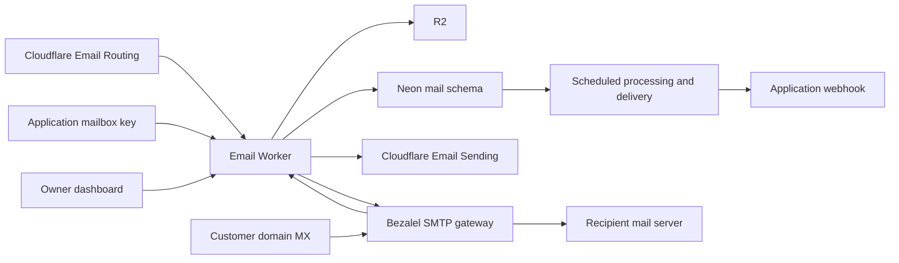

# Bezalel email

A Cloudflare Worker that implements Bezalel's mailbox provider. Cloudflare sends
and receives mail for managed domains. An optional Bezalel SMTP gateway handles
customer domains at any DNS provider. This app stores inboxes, message bodies, threads, labels,
search indexes, send receipts, and event queues in Neon. R2 stores raw incoming
messages and attachments.

The standalone dashboard uses the Worker's platform token on the server only.
For applications and agents, provision a mailbox-specific token through the
client API described below. The platform token controls every mailbox.

The source application remains in Bezalel. See [the project README](../../README.md)
for the dashboard and [SOURCE.md](../../SOURCE.md) for extraction details.



## Set up Cloudflare

1. Enable the Workers Paid plan and Email Sending for your account.
2. Onboard a domain for both Email Sending and Email Routing in Cloudflare.
   This version supports zone apex domains, such as `example.com`. Cloudflare
   manages their sending and routing DNS records.
3. Create an R2 bucket with `pnpm --filter @bezalel/email exec wrangler r2 bucket create bezalel-email-standalone`.
4. Edit `wrangler.jsonc`. Set `PUBLIC_EMAIL_URL` to the Worker's public origin,
   `DEFAULT_EMAIL_DOMAIN` to your domain. Set `EMAIL_DOMAINS` to a JSON map of
   allowed domains and their zone IDs, for example
   `{"example.com":"0123456789abcdef0123456789abcdef"}`. Keep `WORKER_NAME`
   equal to the deployed Worker name.
5. Create a Cloudflare API token with Email Sending access and read access to
   Email Routing settings and rules for those zones. The Worker reads domain
   configuration; it does not change DNS or routing rules.
6. Generate independent API and signing secrets:

   ```sh
   node -e 'console.log(require("node:crypto").randomBytes(32).toString("hex"))'
   node -e 'console.log("whsec_" + require("node:crypto").randomBytes(32).toString("base64"))'
   ```

7. Set each Worker secret with `pnpm --filter @bezalel/email exec wrangler secret put NAME`:
   `DATABASE_URL`, `MAIL_API_TOKEN`, `MAIL_WEBHOOK_SECRET`,
   `CLOUDFLARE_ACCOUNT_ID`, and `CLOUDFLARE_API_TOKEN`.
8. Put the same Neon `DATABASE_URL` in a local `apps/email/.env` and run
   `pnpm --filter @bezalel/email migrate`. This creates only the `mail` schema;
   it does not modify other schemas. Use a dedicated Neon database with a role allowed to create that schema.
9. Deploy with `pnpm --filter @bezalel/email deploy`. In Cloudflare Email
   Routing, send the domain's catch-all to this Worker. Remove any specific
   address rules that would override this route for agent addresses.

Run `migrate` before deploying an upgrade too. Applied schema changes are recorded
in `mail.schema_migrations`. The search-index upgrade replaces the old generated
column and its index in one transaction, preserves messages, and can be rerun.
It takes a table lock while rebuilding the index; schedule it during a quiet period.

The Worker checks that Cloudflare has enabled sending and receiving for each
managed domain and that its catch-all targets this Worker. Managed domains need
operator onboarding in Cloudflare and an `EMAIL_DOMAINS` entry. Customer domains
use the separate SMTP setup below and must not be added to `EMAIL_DOMAINS`.

Cloudflare's [Email Service docs](https://developers.cloudflare.com/email-service/),
[sending API](https://developers.cloudflare.com/api/resources/email_sending/methods/send/),
and [domain setup](https://developers.cloudflare.com/email-service/configuration/domains/)
describe account permissions and provider setup. Email Sending is currently beta.

## Customer domains

Open Custom domains in the dashboard to add a domain. Bezalel returns
ownership TXT, MX, SPF, DKIM, and DMARC records. After the owner adds these at
their DNS provider, Verify checks each record. Use the verified domain in the new-inbox form. The Worker verifies domain ownership and rejects removal while inboxes exist.
The standalone dashboard gives its owner access to the entire deployment. No Cloudflare login or nameserver change is needed
for the customer.

This path requires a Bezalel SMTP host. Cloudflare's sending service requires
its domains in the Worker's Cloudflare account, so it cannot accept arbitrary
customer domains through DNS records alone. Follow the
[SMTP deployment runbook](../../ops/email/README.md) before enabling customer
domains. It covers the static IPv4 address, reverse DNS, TLS, durable queue,
Worker secrets, migration, and delivery canary.

The Worker creates a separate RSA-2048 DKIM key for each domain and encrypts
the private key with `MAIL_DOMAIN_ENCRYPTION_KEY`. DNS checks use Cloudflare's
public resolver and refresh at most every five minutes during use. Deleting and
adding a domain creates a new ownership challenge and DKIM selector. Existing
inboxes must be removed first, and retired addresses cannot be reused.

Custom-domain sends return a queued receipt after Postfix accepts the message.
The gateway retries delivery for up to five days. Its durable journal maps Postfix
queue IDs to stored messages and reports delivered, deferred, and bounced outcomes
to the Worker. The same delivery snapshots reach the dashboard and application webhooks. A recipient server accepting SMTP does not prove inbox placement or a read.
Managed-domain delivery events continue through Cloudflare's queue.

## Delivery tracking

Create the delivery queue and its dead-letter queue before deploying this upgrade:

```sh
pnpm --filter @bezalel/email exec wrangler queues create bezalel-email-standalone-delivery
pnpm --filter @bezalel/email exec wrangler queues create bezalel-email-standalone-delivery-dead
```

Run the mailbox migration, then deploy the Worker. For each
allowed sending domain, subscribe the delivery queue to all six lifecycle events:

```sh
pnpm --filter @bezalel/email exec wrangler queues subscription create bezalel-email-standalone-delivery \
  --source email.sending --zone-id YOUR_ZONE_ID --domain YOUR_SENDING_DOMAIN \
  --events cf.email.sending.message.delivered,cf.email.sending.message.deferred,cf.email.sending.message.bounced,cf.email.sending.message.failed,cf.email.sending.message.rejected,cf.email.sending.message.complained
pnpm --filter @bezalel/email exec wrangler queues subscription list bezalel-email-standalone-delivery
```

Use the account and domain IDs from the Worker's configuration. The queue handler
validates account, zone, sender, and recipient against the stored message before
applying an event. Test inboxes get delivery status without production analytics
or agent events. Database errors and events that arrive before message storage
retry after a minute; repeated failures move to `bezalel-email-standalone-delivery-dead`.
Monitor that queue in Cloudflare and replay its messages to the delivery queue
after fixing the cause. Duplicate and older events are safe to replay.

Cloudflare's [email event schemas](https://developers.cloudflare.com/email-service/platform/event-subscriptions/)
and [subscription guide](https://developers.cloudflare.com/queues/event-subscriptions/manage-event-subscriptions/)
describe the provider setup. Provisioning subscriptions is an operator step;
merging application code alone does not enable provider lifecycle events.

Each send stores initial recipient outcomes from the send receipt. Queue events
then update the message and an atomic signed outbox. Configured application webhooks receive `email.delivery_updated` snapshots.
The minute cron retries signed updates if the destination is unavailable.

Full message and thread reads include `delivery` with a version, send time,
update time, and per-recipient outcomes. Accepted and queued are pending;
deferred means the sending provider is retrying. Bounced, failed, and rejected are terminal.
Complaints remain visible even if an older delivered event arrives later.
Delivered means the recipient mail server accepted the message, not that the
recipient opened it. Provider failure text is untrusted email data.

Bezalel can consume these events for its own analytics. This standalone dashboard
shows delivery outcomes on individual messages.

## Suppression and incoming protection

Custom-domain hard bounces with a permanent `5.x` SMTP code suppress that recipient
for the sending inbox. Verified provider complaints do the same. Later sends keep
the original To/Cc headers but exclude suppressed recipients from the SMTP
envelope. BCC stays out of the wire message. If every recipient is suppressed, the
send records rejected outcomes without contacting the gateway. Temporary failures
and a retry queue expiring with a `4.x` code do not suppress recipients. There is
no automatic expiry or owner override for these suppressions in this version.
Managed-domain suppression remains Cloudflare's responsibility.

Complaint intake is optional and needs provider feedback-loop enrollment. Set
`MAIL_FEEDBACK_SIGNERS` on the Worker to the comma-separated DKIM signing domains
confirmed by those providers. This enables only `feedback@MAIL_GATEWAY_HOSTNAME`.
A report must use ARF (`multipart/report; report-type=feedback-report`), have a
verified, allowlisted DKIM signature covering the full body and MIME header, and
identify an actual custom-domain message, sender, and recipient. Unsigned,
partially signed, redacted, and unmatched reports do not suppress addresses.
An arbitrary inbound bounce or a sender-supplied authentication header cannot
authorize suppression. Test each enrolled provider's report format before rollout.

All custom-domain incoming mail passes Rspamd and ClamAV before mailbox delivery.
Spam, failed sender authentication, malware, and encrypted or oversized content
that ClamAV cannot inspect go to Quarantine. The normal inbox, search, and
`email.received` events omit quarantined messages. Direct message reads include
`protection`: computed SPF/DKIM/DMARC, verified signing domains, spam score,
attachment scan, reasons, and review state. Treat the email body as untrusted even
when these checks pass. Authentication-Results headers in the message do not set
these fields.

Ordinary message and thread reads omit held text, HTML, and body previews, even
when an agent requests the quarantine label or asks for bodies. The standalone dashboard reads held bodies through the privileged `reviewThread`
operation after owner sign-in. Mailbox-scoped credentials cannot invoke it. Owner release restores ordinary
body reads.

Owners can inspect Quarantine in the existing email page and release messages
whose attachment scan passed. Release records the signed-in owner and time,
updates the mailbox, and emits one incoming event through the signed outbox.
Agents cannot invoke release. Replies, forward drafts, attachment downloads, and
removing the quarantine label cannot bypass the hold. Malware and incomplete
attachment scans cannot be released.

To scan managed-domain mail too, deploy healthy gateway scanners first, then set
`MAIL_INBOUND_SCAN_ENABLED=true` on the Worker. This uses the same scan endpoint
while Cloudflare keeps receiving SMTP and R2 keeps storing raw mail. The original
SMTP IP is unavailable on this path, so SPF is reported as `unavailable`; DKIM and
DMARC are computed from the message and DNS. Scanner outages retain incoming jobs
for retry rather than sending unchecked mail to agents. The flag defaults off for
staged deployment and does not rescan historical messages.

See the [gateway runbook](../../ops/email/README.md) for resource requirements,
upgrade order, scanner health, durable reports, and deployment canaries.

## Webhooks and Bezalel integration

Set optional `MAIL_EVENTS_URL` to an HTTPS endpoint that verifies the signed
email events. There is no required Bezalel server or fixed URL path.
`BEZALEL_EVENTS_URL` remains accepted for existing Bezalel integrations;
`MAIL_EVENTS_URL` takes precedence. Mailbox clients always use their own
provisioned webhook and signing secret.

When neither shared URL is configured, shared-mailbox events are settled
without delivery. They are not replayed if a URL is configured later.
Mailbox storage, sending, delivery tracking, and client webhooks still work.

To connect a Bezalel server, set its `CLOUDFLARE_EMAIL_URL` to this Worker's
origin and `CLOUDFLARE_EMAIL_TOKEN` to `MAIL_API_TOKEN`. Set this Worker's
`MAIL_EVENTS_URL` to that server's `/events/cloudflare` endpoint. Bezalel
continues to own its tenant policies, agent scopes, billing, and analytics.
Those services are not required by this standalone project.

## Processing and failure behavior

- The Worker accepts mail only for an active inbox. Unknown recipients are
  rejected, even with a catch-all. It stores the raw message in R2 and an
  incoming job in Neon before the email handler completes.
- A scheduled handler runs every minute. Incoming jobs and outbound webhooks
  use leased rows, retries with capped backoff, and stable IDs. Failed jobs
  remain queued; there is no automatic expiry that silently drops mail.
- MIME parsing handles HTML, text, Reply-To, and attachments. HTML-only mail
  gets plain text for previews, search, and agent events. Incoming envelope
  recipients select the mailbox. Sender-controlled To headers cannot select a
  different tenant. Message-ID deduplicates deliveries within an inbox;
  missing IDs use a digest of the raw message.
- Replies use In-Reply-To and References. Thread lookup is scoped to the inbox.
  Reply-all excludes the sending inbox and never copies BCC recipients.
- Message lists return previews. HTML is returned only when requested.
  Full thread bodies are limited to 8 MiB and threads to 500 messages; individual
  message reads remain available. Search uses PostgreSQL full-text ranking and
  indexes the first 131,072 body characters plus bounded header fields. This
  keeps large messages below PostgreSQL's index limit; stored bodies stay whole.
- Attachment links expire after five minutes. Downloads check that the inbox
  and message still exist and force download with an inert content type.
- Deleting an inbox removes its mail and queues R2 cleanup. Its address stays
  retired so a later tenant cannot receive mail intended for a previous owner.
- Send receipts include delivered, queued, bounced, and suppressed recipients.
  The app stores sent mail and emits `email.bounced` for immediate bounces or
  suppressions. Later outcomes arrive through Cloudflare's subscribed queue or
  the native gateway journal and update the same delivery snapshot.

Cloudflare does not document a send idempotency key. The app reserves each send
in Neon before dispatch. A successful replay returns the original receipt; a
timeout or unreadable response keeps the reservation pending and refuses to
dispatch it again. A 429 response permits another attempt with the same key
and content after the provider limit clears. A database failure after Cloudflare
accepts the message has the same pending outcome. Inspect its activity log before reconciling
such a send. Inbox deletion is blocked while a send is pending. Never release a
pending send just to retry it, since the recipient may already have the email.

Mail and raw MIME persist until inbox deletion. Failed parsing and webhook jobs
are visible in `mail.incoming` and `mail.outbox`; pending outbound sends are in
`mail.sends`. These tables contain email data and should have the same access
and backup controls as the rest of Bezalel's database. Worker request logging is
disabled because attachment URLs contain temporary download credentials.

## Local checks

```sh
pnpm --filter @bezalel/email check
pnpm --filter @bezalel/email build
pnpm --filter @bezalel/email test
```

Tests run the SQL migrations and mailbox operations on PGlite's embedded
PostgreSQL. Cloudflare, R2, and webhook HTTP responses use test doubles. The
server tests cover adapter decoding, provider defaults, signed ingress, tenant
attribution, and webhook startup. These checks do not prove live delivery or
DNS configuration.

For local Worker development, copy `.dev.vars.example` to `.dev.vars`, set a
dedicated development Neon database, migrate it, and run
`pnpm --filter @bezalel/email dev`. Wrangler uses local R2 storage. Its development
email handler can be exercised with Wrangler's email testing endpoint. Sending
through the configured Cloudflare API remains a live operation.

## Product mailbox access

An application can share this Worker without receiving `MAIL_API_TOKEN`. The platform
uses that token only to provision a mailbox through `POST /clients/provision`:

```json
{
  "clientId": "agent-<instance-uuid>",
  "username": "agent-<instance-slug>",
  "displayName": "Example agent",
  "webhookUrl": "https://<instance-host>/email/inbound",
  "dailySendLimit": 250
}
```

The response contains `{ "result": { "inboxId", "apiKey", "webhookSecret",
"webhookUrl", "clientId", "dailySendLimit", ... } }`. Store only the returned
mailbox credential and signing secret on the instance. Provisioning is atomic
and repeats return the same mailbox and credential. A client ID cannot adopt
an existing unrelated mailbox, and a deleted address is never reused.

Instances call `POST /inbox-rpc/<operation>` with their `gme_...` bearer token.
Supported operations are `getInbox`, `send`, `reply`, `listMessages`,
`getMessage`, `listThreads`, `getThread`, `searchMessages`, `getAttachment`,
`updateThreadLabels`, `updateMessageLabels`, `ensureWebhook`, and
`webhookStatus`. Inputs and outputs use the same camelCase RPC contract as
`/rpc`. `inboxId` is optional; if supplied, it must match the credential.
These tokens cannot list other mailboxes, provision clients, access test
mailboxes, manage domains, or release quarantine.

Only the platform can set the webhook URL. Calling `ensureWebhook` with that
URL confirms its registration and returns the inbox's signing secret. The
outbox delivers the existing `email.received` event with Svix headers to that
instance. Mailboxes without a product client retain the Bezalel destination.
Failed deliveries stay in the existing retry queue.

`POST /clients/rotate` with `{ "clientId": "..." }` invalidates the previous
mailbox token and returns replacement credentials. It preserves the signing
secret so queued deliveries continue to verify. `POST /clients/delete`
deletes the client's mailbox and revokes access; it is safe to repeat.
Pending sends prevent deletion until their outcome is resolved.

The default product limit is 250 sends per rolling 24 hours. The platform may
set a limit from 1 to 10,000. The database serializes send reservations per
mailbox, counts pending and sent attempts, and does not count a successful
idempotency replay twice. These limits are separate from Bezalel's owner and
agent policies. Cloudflare's account limits still apply to the shared fleet.

Run the email database migration before deploying the updated Worker. The
new `mail.clients` table and send reservation function support both the
existing Bezalel route and product inboxes. Rotating `MAIL_API_TOKEN` changes
all derived product credentials; reconcile each instance afterward. Rotating
`MAIL_WEBHOOK_SECRET` also changes product signing secrets and requires the
same coordinated update.
